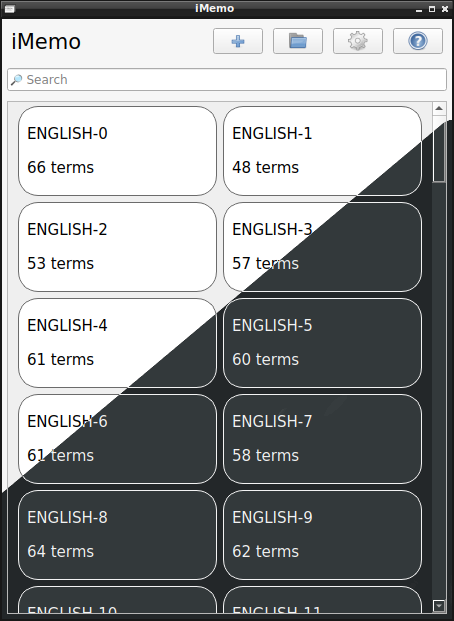
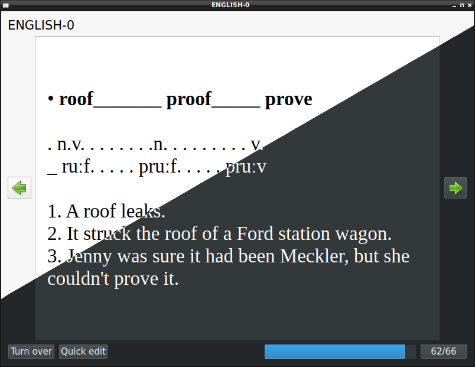
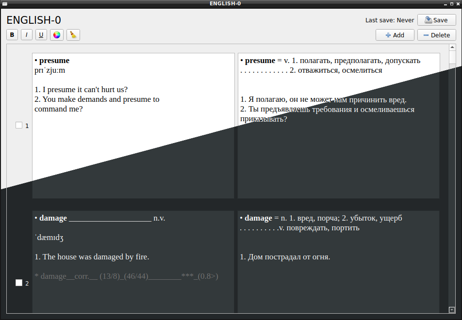
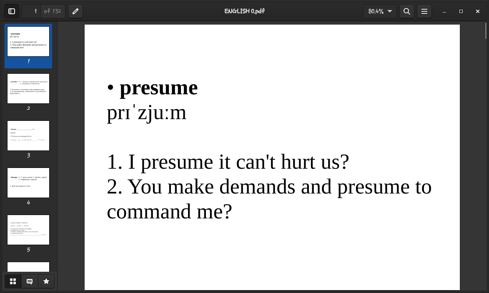

# iMemo

## Features
- Rich Text Support
  - Bold, Italic, Underline
  - Foreground color

- Auto-save (with customizable interval)

- Customizable font family

- Export to PDF (A6 flashcards) support

- Light & Dark theme

- and many others!

## Screenshots

## Installation guide
(from binary packages) 
  Go to <a href="https://github.com/thm-unix/iMemo/releases">Releases</a> page to download the latest package for your operating system

(from source)
  1. Install Qt
  2. git clone https://github.com/thm-unix/iMemo
  3. cd iMemo
  4. qmake
  5. make

## Feedback
If you found a bug or want to make a feature request, feel free to leave feedback at <a href="https://github.com/thm-unix/iMemo/issues">Issues</a> page!
